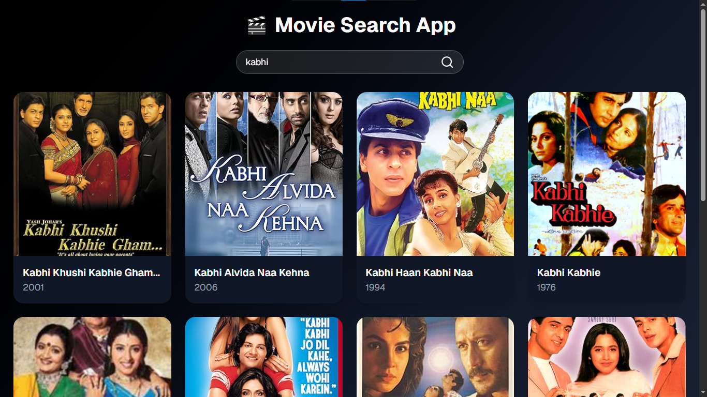

# 🎬 Movies Search App

A simple and responsive **Movies Search App** built using **React**, **Vite**, **Tailwind CSS**, **Axios**, and **shadcn/ui**.

## ✨ Features

* Search movies by title
* Display movie posters and details
* Responsive design
* Clean and modern UI

## 🛠️ Tech Stack

* React
* Vite
* Tailwind CSS
* Axios
* shadcn/ui
* Lucide React

## 📸 Screenshot





## 🚀 Installation

```bash
git clone https://github.com/your-username/movies-search-app.git

cd movies-search-app

npm install

npm run dev
```

## 📁 Project Structure

```text
movies-search-app/
│
├── public/
│   └── output.png
├── src/
├── package.json
└── README.md
```

## 👩‍💻 Author

**Pranali**

⭐ If you like this project, give it a star on GitHub!
